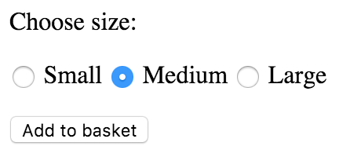

# Problems

Alright, let's get busy!


## Problem 1

Research about the following HTML tags and explain their semantics:

1. `<strong>`
2. `<em>`
3. `<blockquote>`
4. `<q>`
5. `<abbr>`
6. `<cite>`
7. `<dfn>`
8. `<address>`
9. `<ins>`
10. `<del>`
11. `<s>`

## Problem 2

Explain why do we need `<thead>`, `<tbody>` and `<tfoot>`?

## Problem 3

Create a web page (`day-02/solution-03/index.html` file) that renders this list:

<ul>
  <li>Milk</li>
  <li>Bread</li>
  <li>Tomatos</li>
</ul>

## Problem 4

Create a web page (`day-02/solution-04/index.html` file) with the following information structured in a list:

```
Monday
Tuesday
Wednesday
Thursday
Friday
Saturday
Sunday
```

_Hint_: think about order.

## Problem 5

Create a markdown file (`day-02/solution-05/README.md` file) with the following table using HTML:

<table>
  <tr>
    <th></th>
    <th>09:00</th>
    <th>10:00</th>
    <th>11:00</th>
    <th>12:00</th>
    <th>13:00</th>
    <th>14:00</th>
    <th>15:00</th>
    <th>16:00</th>
    <th>17:00</th>
  </tr>
  <tr>
    <th>Monday</th>
    <td colspan="3">Class</td>
    <td colspan="2">Lunch</td>
    <td colspan="4">Lab</td>
  </tr>
  <tr>
    <th>Tuesday</th>
    <td colspan="3">Class</td>
    <td colspan="2">Lunch</td>
    <td colspan="4">Lab</td>
  </tr>
  <tr>
    <th>Wednesday</th>
    <td colspan="3">Class</td>
    <td colspan="2">Lunch</td>
    <td colspan="4">Lab</td>
  </tr>
  <tr>
    <th>Thursday</th>
    <td colspan="3">Class</td>
    <td colspan="2">Lunch</td>
    <td colspan="4">Lab</td>
  </tr>
  <tr>
    <th>Friday</th>
    <td colspan="3">Lab</td>
    <td colspan="2">Lunch</td>
    <td colspan="4">Lab</td>
  </tr>
  <tr>
    <th>Saturday</th>
    <td colspan="9">Homework</td>
  </tr>
  <tr>
    <th>Sunday</th>
    <td colspan="9">Homework</td>
  </tr>
</table>

_Hint_: search for _spanning columns_.

## Problem 6

Create a markdown file (`day-02/solution-06/README.md` file) with the following table using HTML:

<table>
  <tr>
    <td>1</td>
    <td>2</td>
  </tr>
  <tr>
    <td>3</td>
    <td>
      <table>
        <tr>
          <td>
            <table>
              <tr>
                <td>4</td>
                <td>5</td>
              </tr>
              <tr>
                <td>7</td>
                <td>8</td>
              </tr>
            </table>
          </td>
          <td>6</td>
        </tr>
        <tr>
          <td>9</td>
          <td>10</td>
        </tr>
      </table>
    </td>
  </tr>
</table>

## Problem 7

Create a markdown file (`day-02/solution-07/README.md`) with the following table using HTML:

<table>
  <tr>
    <td>1</td>
    <td colspan="3">2</td>
  </tr>
  <tr>
    <td rowspan="3">3</td>
    <td>4</td>
    <td>5</td>
    <td rowspan="2">6</td>
  </tr>
  <tr>
    <td>7</td>
    <td>8</td>
  </tr>
  <tr>
    <td colspan="2">9</td>
    <td>10</td>
  </tr>
</table>

## Problem 8

Create a markdown file (`day-02/solution-08/README.md`) with the following table using HTML:

<table>
  <tr>
    <td colspan="4">1</td>
  </tr>
  <tr>
    <td rowspan="3">2</td>
    <td>3</td>
    <td>4</td>
    <td rowspan="3">5</td>
  </tr>
  <tr>
    <td>6</td>
    <td>7</td>
  </tr>
  <tr>
    <td>8</td>
    <td>9</td>
  </tr>
</table>

## Problem 9

Create a web page (`day-02/solution-09/index.html` file) with the comment form:


## Problem 10

Create a web page (`day-02/solution-10/index.html` file) with the product size form:



## Problem 11

Create a web page (`day-02/solution-11/index.html` file) with the questionnaire form:


Make sure user can click on `Monday` (and other week days) to select/deselect it.

## Problem 12

Research and provide example of how to validate form with HTML5.

## Problem 13

Research and provide example of HTML5:
+ Date input
+ Email input
+ Url input
+ Search input

## Problem 14


Build The Shard building information web page.

It should have:

+ Header.
+ Introductory paragraph + 1 image.
+ Paragraph about planning + 1 image.
+ Paragraph about funding + 1 image.
+ Fact sheet:
  + Floor count
  + Number of elevators
  + Floor area
  + Construction started
  + Construction completed
  + Any fun facts that you can find out.
+ Table of tenants (maximum of 15) with thier approximate move in date and a link to their website (if any).
+ Company (tenants) search form.
+ Form for booking a visit:
  + Date (required).
  + Number of people (default - 1).
  + Floor (required).
  + Restaurant? (Yes or No, defalt - No).
  + If yes, then which restaurant - choose from a list (default - empty).
  + Number of children (number, maximum 5, required).
  + Phone number (optional).
  + Email (required).
+ Embed short YouTube video about The Shard.
+ Embed Google Maps pointing to The Shard location. Instructions: https://support.google.com/maps/answer/3544418?hl=en
+ Links to newspaper articles about The Shard (all should open in a new tab).

Create `day-02/solution-13/index.html` file with a valid HTML markup.

Think of a structure.

No need for styling.

__Bonus points__: use `placeholder` attribute.

## Problem 15

Research and explain what `<iframe></iframe>` is good for?

## Problem 16

Build your portfolio page in https://github.com/your-username/portfolio repository.

+ Update `index.html` file.
+ 

## Well done!


